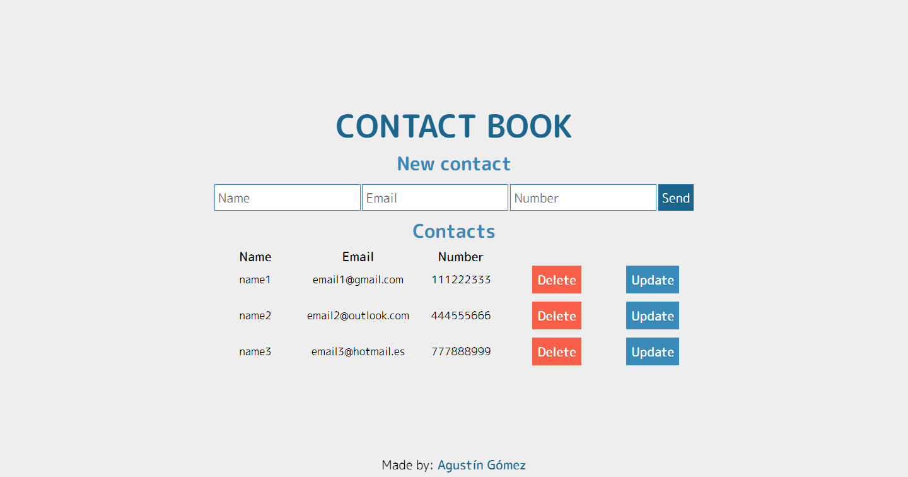

# Contact book

A basic contact book made with PHP and MySQL.

## Deployment

To deploy this project you have to download the zip and place it in the local server folder, then you need to create a database and import 'contact_book.sql'.

Edit the file 'db.php' with your localhost, username, password and database name.

```php
$localhost = "localhost";
$username = "root";
$password = "";
$dbname = "contact_book";
```

Later you can launch the project in a Apache server. (Ex: http://localhost/contact-book/index.php)
## Demo


